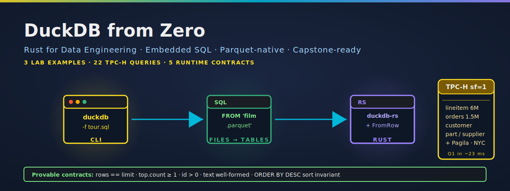

  

# DuckDB From Zero — Companion Repo

The runnable companion to the Coursera course **DuckDB From Zero**, part of the
*Rust for Data Engineering* specialization.

This repo bundles every example shown in the videos plus the optional Rust
capstone artifact (`duckdb-reports`). The Coursera lab boots a sandbox with the
same fixtures pre-loaded — but you can also run everything locally.

## Quick start

    git clone https://github.com/paiml/duckdb-from-zero
    cd duckdb-from-zero
    make demo         # downloads fixtures, runs the three SQL tour scripts
    make capstone     # builds and runs the Rust binary against Pagila Parquets

The first `make` call takes 60–120 seconds (TPC-H sf=1 generation + Pagila
download + NYC Taxi download). Subsequent calls are instant.

## Installation

One-line install for each prerequisite:

    curl -fsSL https://install.duckdb.org/ | sh    # DuckDB CLI 1.5+ → ~/.local/bin/duckdb
    curl -sSf https://sh.rustup.rs | sh            # rustup; rust-toolchain.toml pins the rest

Then:

    git clone https://github.com/paiml/duckdb-from-zero
    cd duckdb-from-zero
    make fetch                                     # ~60–120 s; populates data/

`make fetch` is idempotent — re-running is a no-op once `data/` is populated.

## Usage

    make demo         # SQL tour: 01-tour, 02-files-as-tables, 03-tpch-q1
    make capstone     # Rust binary: customers, films, actors reports
    make verify       # CI smoke test: assert TPC-H + Pagila headline counts
    make test         # cargo test --release (32 tests)
    make lint         # cargo clippy --all-targets -- -D warnings
    make clean        # rm -rf data/ target/

### Standalone demos

One script per concept — each auto-fetches fixtures, prints a banner per step,
and can be run independently:

    make demo-1-tour     # DuckDB feature tour (the 3 lab SQL files)
    make demo-2-pagila   # 3 raw Pagila analytics queries
    make demo-3-tpch     # all 22 TPC-H benchmark queries, timed
    make demo-4-rust     # Rust capstone binary, 3 contract-enforced reports
    make demo-all        # run every demo in sequence

The TPC-H demo accepts a query list:

    scripts/demo-3-tpch.sh 1 6 9     # only Q1, Q6, Q9

The Rust capstone demo accepts a limit:

    scripts/demo-4-rust.sh 5         # --limit 5; defaults to 10

The Rust capstone binary takes flags directly:

    cargo run --release --bin duckdb-reports -- --report customers --limit 10
    cargo run --release --bin duckdb-reports -- --report films     --limit 10 --out films.json
    cargo run --release --bin duckdb-reports -- --report actors    --limit 10

## What's here

- `sql/` — the SQL the videos walk through, plus all 22 TPC-H benchmark queries
- `crates/duckdb-reports/` — Rust binary that runs three Sakila analytics reports
  with runtime contracts; the foundation for the course capstone
- `scripts/` — the bash glue for fetch, demo, and verify

## Prerequisites

- DuckDB CLI 1.1+ (`curl https://install.duckdb.org/ | sh`)
- Rust 1.95+ (use rustup; `rust-toolchain.toml` will pin automatically)
- ~500 MB free disk for fixtures

## Why DuckDB

Three things you can do here that you cannot easily do with a server-based
database:

1. `SELECT * FROM 'data/pagila/film.parquet'` — the Parquet file is the table.
   No `CREATE TABLE`. No import step. (See `sql/02-files-as-tables.sql`.)
2. Query 6 million rows of TPC-H `lineitem` and have the answer in well under
   a second on a laptop. (See `sql/03-tpch-q1.sql`.)
3. Embed the entire database engine inside a Rust binary that ships as a
   single file with no daemon and no network port. (See `crates/duckdb-reports/`.)

## Quality status

| Metric | Result | Notes |
|--------|--------|-------|
| Tests | 31 passing | 23 lib unit + 5 CLI + 3 integration |
| Line coverage | **99.16%** total / 100% on `main.rs` / 99.09% on `lib.rs` | 3 missed are inside `query_map` closures (unreachable when `prepare()?` fails) |
| Function coverage | **100%** | `cargo llvm-cov --release` |
| `cargo clippy --all-targets -- -D warnings` | **clean** | strict mode |
| `pmat quality-gate` | **0 violations** | excluding `entropy` (reports `repetitions: 0, variation: 1.00` but flags as low — small-repo metric artifact) |

Reproduce: `make test`, `make coverage`, `make lint`, `make pmat`.

## Provable contracts

Every report enforces five named runtime invariants the moment its query
returns. The formal spec lives in [`contracts/duckdb-rust-v1.yaml`](contracts/duckdb-rust-v1.yaml);
each rule maps to an `assert!` in `crates/duckdb-reports/src/lib.rs`:

| ID | Rule | Severity |
|----|------|----------|
| C1 | `rows.len() == limit` (LIMIT N must return N rows) | ERROR |
| C2 | `rows[0].count >= 1` (top record matched the LEFT JOIN) | ERROR |
| C3 | `forall r in rows. r.id > 0` (AUTO_INCREMENT sanity) | ERROR |
| C4 | text fields well-formed (`name` has space, `title` non-empty, etc.) | ERROR |
| C5 | `rows[i].count >= rows[i+1].count` (ORDER BY DESC sort invariant) | ERROR |

Each contract has a `should_panic` unit test that fires on a synthetic
violation, and each report has a positive-path integration test against the
real Pagila fixture. Falsification IDs (`FALSIFY-DUCKDB-001..005`) are listed
in the YAML.

## Capstone

The capstone for this course extends `crates/duckdb-reports/` from three reports
to a configurable analytics tool. See the course's capstone reading for the
detailed brief.

## Contributing

This is a course companion repo, not an actively-developed library. PRs that
improve fidelity to the course videos, fix data-fetch breakage, or harden the
provable contracts are welcome. Before opening a PR:

1. `make test && make lint` must pass cleanly
2. Coverage gate is `cargo llvm-cov --release --workspace` ≥ 95% on `lib.rs`
3. `pmat quality-gate` should not regress on complexity or section checks
4. Any new contract goes in both `contracts/duckdb-rust-v1.yaml` and a
   `should_panic` unit test in `mod tests`

## License

Dual-licensed under MIT or Apache-2.0 at your option (matches the rest of the
PAIML Coursera companion repos). See `LICENSE-MIT` and `LICENSE-APACHE`.
